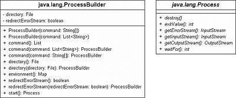
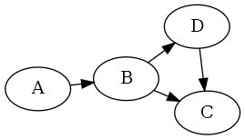

<!DOCTYPE html><html><head>
      <title>part1</title>
      <meta charset="utf-8">
      <meta name="viewport" content="width=device-width, initial-scale=1.0">
      
      <link rel="stylesheet" href="https://cdn.jsdelivr.net/npm/katex@0.13.0/dist/katex.min.css">
      
      
      
      
      
      
      
      
      
      
    </head>
    <body for="html-export">
      

      <h1 class="mume-header" id="9-using-vue-in-markdown-by-vicente-badge-textdefault-theme-verticaltop">9. Using Vue in Markdown by Vicente <badge text="default theme" vertical="top"></badge></h1>

<ul>
<li><a href="#9-using-vue-in-markdown-by-vicente-badge-textdefault-theme-verticaltop">9. Using Vue in Markdown by Vicente <badge text="default theme" vertical="top"></badge></a>
<ul>
<li><a href="#badge-textnew-typeerror91-browser-api-access-restrictions"><badge text="new!" type="error">9.1. Browser API Access Restrictions</badge></a></li>
<li><a href="#92-browser-api-access-restrictions">9.2. Browser API Access Restrictions</a>
<ul>
<li><a href="#921-third-level-heading">9.2.1 Third level heading</a></li>
</ul>
</li>
<li><a href="#93-browser-api-access-restrictions">9.3. Browser API Access Restrictions</a></li>
<li><a href="#94-browser-api-access-restrictions">9.4. Browser API Access Restrictions</a></li>
<li><a href="#95-browser-api-access-restrictions">9.5. Browser API Access Restrictions</a></li>
<li><a href="#96-browser-api-access-restrictions">9.6. Browser API Access Restrictions</a></li>
<li><a href="#97-browser-api-access-restrictions">9.7. Browser API Access Restrictions</a></li>
</ul>
</li>
</ul>
<h2 class="mume-header" id="badge-textnew-typeerror91-browser-api-access-restrictions"><badge text="new!" type="error">9.1. Browser API Access Restrictions</badge></h2>

Because VuePress applications are server-rendered in Node.js when generAAating static builds, any Vue usage must conform to the <a href="https://ssr.vuejs.org/en/universal.html">universal code requirements</a>. In short, make sure to only access Browser / DOM APIs in <code>beforeMount</code> or <code>mounted</code> hooks.

Pasaremos los datos necesarios para construir un objeto ISBN al constructor de Libro (en nuestro caso una cadena con el isbn) y ser&#xE1; este quien lo cree. En el fondo esto es lo que sucede con un tipo valor como DateTime por su &apos;naturaleza&apos;. 
De esta manera, adem&#xE1;s, el objeto Isbn13 que estoy creando desaparecer&#xE1; junto con el libro.

If you are using or demoing components that are not SSR friendly (for example containing custom directives), you can wrap them inside the built-in <code>&lt;ClientOnly&gt;</code> component: &#x2764;&#xFE0F;

<pre data-role="codeBlock" data-info="php" class="language-php"># Post Here Code Example
function base(a, b)
{
    print &quot;hola&quot;;
}
</pre><pre data-role="codeBlock" data-info="java" class="language-java"># Post Here Code Example
</pre><pre data-role="codeBlock" data-info="yaml as=&quot;yaml&quot; code_block=&quot;true&quot; class=&quot;line-numbers&quot; highlight=&quot;5,8-10,12&quot;" class="language-yaml line-numbers" data-line="5,8-10,12">---
home: true
heroImage: /Logo_PSP.png
tagline: VuePress &amp; Markdown
actionText: Access course &#x2192;
actionLink: /unit1/
features:
- title: Feature 1 T&#xED;tulo
  details: Feature 1 Description
- title: Feature 2 Title
  details: Feature 2 Description
- title: Feature 3 Title
  details: Feature 3 Description
footer: Made by Vicente Mart&#xED;nez with &#x2764;&#xFE0F;
---

</pre>
 

<!--?xml version="1.0" encoding="UTF-8" standalone="no"?-->

<!-- Generated by graphviz version 2.40.1 (20161225.0304)
 -->
<!-- Title: A Pages: 1 -->
<svg width="62pt" height="188pt" viewBox="0.00 0.00 62.00 188.00" xmlns="http://www.w3.org/2000/svg" xlink="http://www.w3.org/1999/xlink">
<g id="graph0" class="graph" transform="scale(1 1) rotate(0) translate(4 184)">
<title>A</title>
<polygon fill="#ffffff" stroke="transparent" points="-4,4 -4,-184 58,-184 58,4 -4,4"/>
<!-- S -->
<g id="node1" class="node">
<title>S</title>
<ellipse fill="none" stroke="#000000" cx="27" cy="-162" rx="27" ry="18"/>
<text text-anchor="middle" x="27" y="-157.8" font-family="Times,serif" font-size="14.00" fill="#000000">S</text>
</g>
<!-- X -->
<g id="node2" class="node">
<title>X</title>
<ellipse fill="none" stroke="#000000" cx="27" cy="-90" rx="27" ry="18"/>
<text text-anchor="middle" x="27" y="-85.8" font-family="Times,serif" font-size="14.00" fill="#000000">X</text>
</g>
<!-- S&#45;&gt;X -->
<g id="edge1" class="edge">
<title>S-&gt;X</title>
<path fill="none" stroke="#000000" d="M27,-143.8314C27,-136.131 27,-126.9743 27,-118.4166"/>
<polygon fill="#000000" stroke="#000000" points="30.5001,-118.4132 27,-108.4133 23.5001,-118.4133 30.5001,-118.4132"/>
</g>
<!-- Y -->
<g id="node3" class="node">
<title>Y</title>
<ellipse fill="none" stroke="#000000" cx="27" cy="-18" rx="27" ry="18"/>
<text text-anchor="middle" x="27" y="-13.8" font-family="Times,serif" font-size="14.00" fill="#000000">Y</text>
</g>
<!-- X&#45;&gt;Y -->
<g id="edge2" class="edge">
<title>X-&gt;Y</title>
<path fill="none" stroke="#000000" d="M27,-71.8314C27,-64.131 27,-54.9743 27,-46.4166"/>
<polygon fill="#000000" stroke="#000000" points="30.5001,-46.4132 27,-36.4133 23.5001,-46.4133 30.5001,-46.4132"/>
</g>
</g>
</svg>

<table>
<thead>
<tr>
<th style="text-align:center"></th>
</tr>
</thead>
<tbody>
<tr>
<td style="text-align:center"><em>Cross-Relation</em></td>
</tr>
</tbody>
</table>
<figure>
    <img src="data:image/svg+xml;charset=utf-8;base64,PD94bWwgdmVyc2lvbj0iMS4wIiBlbmNvZGluZz0iVVRGLTgiIHN0YW5kYWxvbmU9Im5vIj8+CjwhRE9DVFlQRSBzdmcgUFVCTElDICItLy9XM0MvL0RURCBTVkcgMS4xLy9FTiIgImh0dHA6Ly93d3cudzMub3JnL0dyYXBoaWNzL1NWRy8xLjEvRFREL3N2ZzExLmR0ZCI+CjxzdmcgdmVyc2lvbj0iMS4xIiBpZD0iTGF5ZXJfMSIgeG1sbnM9Imh0dHA6Ly93d3cudzMub3JnLzIwMDAvc3ZnIiB4bWxuczp4bGluaz0iaHR0cDovL3d3dy53My5vcmcvMTk5OS94bGluayIgeD0iMHB4IiB5PSIwcHgiIHdpZHRoPSIyNjlweCIgaGVpZ2h0PSIxNTNweCIgdmlld0JveD0iMCAwIDI2OSAxNTMiIGVuYWJsZS1iYWNrZ3JvdW5kPSJuZXcgMCAwIDI2OSAxNTMiIHhtbDpzcGFjZT0icHJlc2VydmUiPiAgPGltYWdlIGlkPSJpbWFnZTAiIHdpZHRoPSIyNjkiIGhlaWdodD0iMTUzIiB4PSIwIiB5PSIwIgogICAgaHJlZj0iZGF0YTppbWFnZS9wbmc7YmFzZTY0LGlWQk9SdzBLR2dvQUFBQU5TVWhFVWdBQUFRMEFBQUNaQ0FBQUFBQVErVEExQUFBQUJHZEJUVUVBQUxHUEMveGhCUUFBQUNCalNGSk4KQUFCNkpnQUFnSVFBQVBvQUFBQ0E2QUFBZFRBQUFPcGdBQUE2bUFBQUYzQ2N1bEU4QUFBQUFtSkxSMFFBLzRlUHpMOEFBQUFKY0VoWgpjd0FBQUdBQUFBQmdBUEJyUXM4QUFBQUhkRWxOUlFmbEJBMFRBUTV0ZEYvakFBQVJwRWxFUVZSNDJ1MWRlVUJUVjlZL0w4bURDQ0pSCmRnZ29GQVJaUk1XNkFLSzJVSzJvMWJwVU85cldxcmkwVmR1eDJqclRhaDJ0dFg1T280NzFzMU8xclg0ZHhWMVU3T0NLZ0NJdUlJdVcKZ0ZUWkRJc1M5aVhKblQ5Q0lDSEpmZThtZnFVdjQrK3Z2SHZQT2UvbGwzUGZQZmZlYzI4b0JNL1JBVjUzUDhBZkNzL1owTVp6TnJRaAo2TzRIZVBab2xaVTBLT3FBMzR0eWRuWDZMMmFqSVQwckwvczNtVmFKdGJ0L1NGQllFTVhTQUdVcGZZb3k3Y3lWbXdxWDRDQmZzYXVuCnJaVXRvQm9rZTF4YWtwZWIxK3c0NnFYSlh2OUZiQ1QvMzBsWndOaW9LSGREUEdVbFg3NGlENXYrbGh1ekhjUjkxRzRMaENGZjNzZUoKdENUR09kTFRrcGdzY1orTk9vbUxjTzR0WnJtVytHaHFVTHpLb3RsUTd1d2pXdnVVcFhER1JDcmlqZ1d6Y1hNb3Zab3RGd2dobEJFaApXRlpyb1d5b050Tmo4Z2hWOWpuNUdXOVdYR2JqNlRpckxTcGlyZkpvNjI4dGtJM2lZTThNVS9TVTY2blZSa2prYml6NllJeDltdGdVClJkNW4zdk1ydnpjWW5uS1dEZGs0NS9NaUUzWG5PRXpwczhWUUJYOWRkMzh0MDlBUzNYclJ3V1J0UDkrUEhZWVpLT2VxYjN3aXZVMDQKUHRYQjdNS1ZrWVAwaXprNlRra2FkK0JOc3d5b29zc3pyUzJFRFdXby8xRXpUUlFIL08wanZVSnV6bjN0azI0MlhobEJxYkdvQUdmQwpjOFhHR2d0aFEvS09yL0hLVkFUaENDRnBvRjhFenNacXhZLzZoZDBkUTVtQ2EzQVRXdy9oQ0NHRXBQaHZ0ekJFcjRpVHZuRTRLSXlOCm1POVoySWFwZmlmN1h0Y2lUcktSOGpJN3VWZkRWMkJxaC9kTXRRUTJXakpIc3BRTUJzeWJsRC9zdWlXdzhialZsNlZrSUVneHRiN0YKbHNCR05aZ2VrMnZEc2FwckNSZlphQVpybHBKNTRJZXBGVFpaQWhzTzhJU2w1SGVBYTFQVmpwYkFoaVBJMkFrbWdnUlhMYk1JTmh6RQp0MWpKRlV3SVg0NnJ6d2kxQkRaZ1pDb0xvWUpGZnVGWU9WbWhYa2ZOU1RaaXpzc3h0UkVVcEZFVTVRZFNQR2xIZTRaM0xlTGtpTDdXCjdlK0x6TGN5WlBDZXJrV2M5STFlTXlVS3M0MWN2TE5RcjR5VHZnRy9CVWdXbTJrQ3ZlaVdvRmZJU2QrQWZrcy9mMnltaWYvTjNLUmYKeUUzZmdJWXdyM05tL1pDNXcxWitZVEZzd00ySTFldk5VSytPZEx4a1lMbUFxK3NwN3VLVmpzTk0xbTRZWDVOb2I2Q2NxK3NwTUUrMgpqRnBxb3E1OFNtR0tvWndvN3JJQm42RDNTemV3VGZiVFFlbUU2Z3Y5RFZkMTk0eXZHZmlKamlrM1FlMkNXK0JESTFYYzdHSFZtSHNsCmYyZ1NxVkx6cHpGanJ4dE5sK3p1SDlnc1BKMEd2bWxFR3FkZnNOdGp2SmJMYkZUOU9FVUl2WHQrV3NWYUkrMFZtRldLcWVjc0d3VmIKSTNoOEFRVEt2M2F5Vy9XQWpZWXk4UlVZZFJrcndrMDJjdGFHQU0wREFFRVdRdlZiUEhqamp6UXlxQlI5NlUyOWRJRkJpSHRzTkNjdApjd1lyOVV1UHZ3a2hoRkRiOGZGOG0ybjdTNHlwS0RJMmhvSERoL2NaYlhNdk12OWhIbC9aL3BFT3ZjNXYvMWh4NHVqbFZwK293VUVoCnpqclN5b0xzblBUVU90ZlhwbzJobVcxemp3MllkYXl0L1pQMVhlMGdxdkhhMVpTc0tyRDNjSGNYaW5nMkRTMk4xZVdsajF2NFBpK08KaWhyQUxrempJQnYxb1kvVWN6MDh5UWQ2bGJMc0IyVmw1YzF5Vll0MWZVVzB1N3ZIZ0FFOTJKdm1JQnR3YTRRQ0FJQWVlUm43aXgrYQowMFE2N3VCaUxKcHVUUUVBMEQvaDNkOUxVVVpxbVh0czFNNWE5dWRZR29ENlIxKzhZRjk0Ukd5OHV6dE1VdHp3Y2ZrM3FuTGwwK09aCkpKWFdCMGlOYzh3MzBMWkluOHdZY0RpTWJQWXl5ZkxFRDBuTmMydCtvL0x0cEw5OHpnT0F5UFYrekx2VXZJaGJDcWZZdURTSFRtNWYKTFZ6RElvRG9TOHdHaDFxS2NsM01pRHVhcFZNMjBWUmY3clVVWlZGMlFXbFpXWE1OYXJEbDJmY1F1NHI5Z3ZzWitvMUszc3pZdXB6SQp0QmUzMktpNWV1VnFkaE5QTEhZTHN4R0JxQWFlTnBha0h5bEZ0cUdqUmtmYTZjb216SE5LSDBobTNxdWhtalFscXR1NnlrZmJ4dkNwCjRQZjNaZFIzcWFoTi8zNXhJTkF4dThvNnkxclg4dWJXRTVsSENPWERiVUtOYm1LajlYQTBaZi9tWWVPelZyS2ZaL1RrVFRpcFVGOFYKamJBampoMFFhcWFPYzRHTitxL2QrSk1TV2hpa21vNk80M2x1YTBJSUhSRU55VGZsUHE2U1B6NGJ6Vjg3MlgzeWlKVm80WWMyN2p2cQpsa0ZjczBsM0d2YlJINTZOcFA2MmE5alA2ejcrU09qYTY2U0p0NW94blZEaDk0NDM2dCtKQ2JxM2tmMnIzbVZyVG1qZHVTYlc4am9nCkR6aCtYOGU0MWQvNUZMRlNmTytRWEpQdXR0MzVEKzBiSnlQRmR5WVJhODNJRWcxUE5PVjJYcFdrVHZWN2VzWXUvbnNLa3hSYjUxcVoKME1PaU8vQXJtUUp6TEZyN2ExbUpyQUxWS3NHZVorZmg0dWx0MGdabEFJQzlTemVzTVUyVC90SHRiZXZweEdwOTRXRi9JZ1VzR3czWAprbS9tUFFSd2RIV2hSQlNVdHRVWHl4UWdDZ3FOR09QTzlnYWRPTFhvY3hQSkFLQTJOODl4R0V1cTFic1g0V3ZVK0N6eGcyTW4wOXQ4Cmh3Y0hCWXExVXY2UkxEODNKek9qelRmMjlRZytteHQwMmhzOGE3ZXBaQUNBYXZhbExCWUg3K2dpK0hYQ2RDakREYWhteHlCd21QZXoKc1JYY2h2TnJnc0I1eFQyQ0p0azJNcmpKcEhlR0J2WCtvNGxmT2hQZUpwTTN5RWIrQXR1ZUM4NjM0VFh2Yi9DaHhpU3dQdjlDMG9PRQpPME80S2RoSHFySmtqTmxzU044UytPK1VzOUJWbnB0TURVMWdkNStuRHA5aWFqc1N2dU93MzgyamdaQ05UZDVtc3RHNDF0cG5keHRiCjlld1oxRmhXa2RGNnh4cjhjNFFqaEpDa2ZTZXJZVHp1dVkyUWpaOXBzc2JWbFkzei9VUTdpQ3lrRGJaZXg2eWc4bG5GOEJ4cUd1SkEKaWhHS0N5WmtJd1ZLaU9SMTJXajdsRGVETkxGTUlla3hpbkZFZWhFWTNocnRiRWpnTEVib09zTWVhVDBVUXlxUnZFNWsvalI2KzNmeApyb1M5R0gvNWpTZURtYmJQWEFnSVlHVU12eTF2dVBzRnNtZHpvOGtDRG0wMmlrY1ZYWjlQeUFVQVFQQ05xSmdUZUpIVVNGYVd0bjBYCmg5M3FHcEZHOW1SOEQ4SkZoRTQzS2ZVT0lXdGxXcTFsS2Y4b1ZzRHBId3dXMnArR1liSnEwd3VFRHpaNnFZa3RSUjRyT085aGdtY0EKQVBCM2ZqQWJsN21wZXVMQ1pDSWNJWVNrOFJUMjBBeW5LaVl6WGRDM0lPdlU5cFg3aVgxRE5jR1QzZXljWVNobjl0Wk4wTldaNGE0QgpwdU1iT3c2SndFWWN4eW5XZlQvSzM3Umt2SzhRQUdqWXcxYW5ndzJKZ0N3TnRTdWFCa2JxZExSYkhDZHRUdFlrNnJWU1RKTjVta0FqCkhEdkZzRi9JL29FcWVuVDRQZXZUOHpRM0x4UnVNSXNNaE80S3QycGZIZ0pLQVB4Qnl3OFZJNFJRcjczUGhJMXZ4QVFQOUdkTjJsdFAKSlNrYk0vMFpmRkNLRFJNUlF1aXZvbXF0cTJ2cUo3SGlnY09FcjY0R2Y4S09EWWE3TEkwZ1lPTngrOUNiaW1HdDBzN0diVVpYbGdBMgpURVFJMVRwckQwVkt0ZDZ4TlBCN0hXVERoalFjRzMyaGdSOFRzSUdXcVozRDZndFNOaGFITUFyR01YVi9hTDF6YThmbnFsdGFzeDk4CjhMYkNEbE02UjIxWXhzdjVKMGpZS0d2UHNmMkZrSTFHKzc4enlKME5aMjRxai9qSFdncXZ4bisxYkVhWVBZQlE4dzBGTVB4VWpjMXUKa3U5aEJKdEZUUG5UdWxoTUF3QlFUd2paU0lKU0JybTRzeWdPNzhVSW9TaG5BT2dSRVBQdXVyMUo5MGVvdWFCaHhBV0UwTnd3OHBOQQp1MExoOXdHWndpTUJBSUFmZXdVMUcrc1lZenhBNkN3K0ZrQUlyUkdmdUZXaHVaakxCd0NhZWpVZElZVFFIVjY4Mld6ODAwcEtxREdmCkJoRE1KMlhqdGRrTVlwSTRoQkRqY3NOSlNtczY1aS9XUUZQVHN6U1hiNzFBNXVYNnFIVW5kQTJFQ3ZrQS9PL1p5NnNqRkJsVFNCNC8KQlFBazJPT3pBTUFkVlhSZWVMYnczc2c3M0pHQXNySDZZOEtvdWl1V0tEOG5WZkg1RXczS0VRUUtDQ0dFK20vRWN5WlY5MzlNNzlFaQo3Zm1IcElXRk9wWHgxREd6WEdNdmRZNWNLWjhIdHF4akwwMUxHYkFlTHlYUmNJZHZ1UG1RaWFsZFltTk83UDl2cXpXbXFNMkdsd2lrCjFhdExEdFY0QjFvaDlRVUEyTGJpRERZUHJRb2NNYlU3eWlaZURBVVRjZTExKytMTVFZUkt6YVhsUXcvU213RUVka0ozZDNjUnk1WXkKY3lxV3NyT2F6b1RoUFhwUWdNMDZhWHpaL3FLSm5wRmdNM2xiSUVUK1N6c2ZDRHVCWG41b2RXdy9Db0J2NWVEajc5T3Z0eEFBSEVZdgoyWjJMN2VqVlgyK0xDL1paNGpTQkJrUElzZXhGL0hkcW1XMzlUMU80VUgwamlGTWdkSFVHN2JLNmM5NWd4Q0ZqdDBsYzdBK0MwRGUvClBKNVJxcmpiUG5pcXpqbTNZMUdrSFRoTjIyYzhsMGJOUmhwZzlueEpRYlBPQVFEWUYrbWdaVXhmNjYrOFdUV0lGRldUQlp2Vm44cSsKRXZNbkpxbC8zbFNndGh1NnhhVTVJbXJvbW5OMUJrMHBNcmJHQ2dVdi8yQ2t0MWV6b2ZEOGpQZ1o5WkVObHhsbHpydDVIaUd6cWpyZwo1cFhTY2RVU0h3MytranFFMEJzMFVCOTA5ZnQ2U1FDTWxEekVHcXc3Tk4ycTl3cURtMGJiWHdSclBObFBLaG5GY2w4VzBYZkZPOVQ0CnV3UkdNOGJ3bHVnT05HN0gyZmFLeTZtZ0FZQTNwMVc3cG42ems5MlNMQlpHWlYvNTBQTU44TkhPUnBIMUxyUEpLTEZobDVCNGRRaHYKT3B0SFJnaWhHeE9wY1AwMWxPb3RQdFFvR2dDQVA3YnpIeTlVQjF6dFdPZlh0ZjNnUzYvU3k4ZlZkQklmdXRTeXRHTVU3M3F6eldOTQpHZ3BodTVrRDllYjRhQmh4eXFDL0tVLzJVWGVKOUdETndFZzZscmVFZmE0aFFtM2Y5dmJzbW9PbVlhUGE4VjB6eVVpazJJL0xWTDlNCkZUak1QNE5qci9IRVd5S3JOeTRacXo2czJZUkFleFVnaEJEYWJ6ZjRCdUVUVjd4TnZhK2JSZEVSUUp5aURoSWEwMFc1OHh3aStkTE4Kd3ltN0NadFNEU1YxTkNULzdSVmJYdVEzTXVQcWtSMlRTYlRqSFlSYUYxQWZNZVVtRzBDOC9hQmk3ZXZPM0o3bGU4NlRqRys2b082bAoycHQyaERvbENWZVN5L2srQS8zZHhTNk9QQkdsa2l1clpNVmw5N09MVko1Um95Zmhsa0R6Z2p0emt2ZzlUb2ZOdlBxdmlhWThkdEZrCmVXSlE1MlVuRzRwcHFjbUJwcExSTWlrNzVRVlRGQXN5YzNKL2ZWelpXZURpNmg4Y0ZNYXduUkhlK3hZQWFCNm9sQ29Bb0wzbFoxaWQKWXEyUG10ZXlMM2R1OU5ESysyb2FuNWRnb25mSXA5NjVPTmcwVlFBQWFKRTlVZFlxQlhhQ1BpNVdyQlFxbjhocjVFL2xOWEw1aytvYQplYVZ5M1ZwVGI5MGNleS9WdStOS3U3bE90amxLMlBEVUtBb1JrNFFRenhxTGV0MWlQL1dwQi9tUWdJNjRWV2NZcG5pdjYwdVdGWTZJClFzMVp0RFFYUjRpM29laWkxR21lUVRZUU9tUS9rSFFTb25JZXRjUzhiRC96VU5GbnNaa1dFanJvN0RwRWZ4QkR6WmNSV0dyYjFVZDgKbkVEKzJlTTlEK0l0WGwweHg2L1ZNQnNJeFl0dFY3TGxvMjJmTDcycWpxWHcvdytrTkg0Rlhob0hBQkF1d2MzYS9TYmNhWXdOMVBpTgptODBDTmdsV3NrM2U5SUtpYnVVQ29aWGUyQnc4OVl5TU5BNC9pYmwwZ0ZFMkVHcmNHUXhEL3dkL1VGTHR3V2xXZlQ3c2JpNVFteXQyCmxiVWp4MUNDWmVNV3BCbG5BeUdVTXE4UERGbDkydkRVVE51TnJiRkNRZlNQM2ZueWJNY1ZLTVRVU2p2WGp2RVQzRUVyRVVMR2QyUkUKUkNndUgwLzRtaGNRSERKQTdPR2lFYXN1TDgzUHlibGI3enhxMTZSbjgyY0VaaUxGd3dkVHV3VmlPK0lxckprb2RYb2QvcVNheXBTTQozSndpQkR6N0hzSWVUU3A1VXpPQVEwaFFhT1NBN21aQmc2bFdoekMxRVdrc0QrSTVzS0NCRDB3N3g1Mm1UZ1ZvTGk4cmU5clNxQkFJCjdJVHU3aDcyN096L1RpZ2JqYXROQzJkcHhxdWwycG1SRFFBQUVIcDdNd3QxRjRoM3lodUdJMVE1QTZkT25EQUlGZllMaExQTnRoV0EKQWl5QURRZnNuNGRnLzJsSUc1WGdaQWxzT0dOUHNmb1l6clIvU3FTdytRWGxmQWRMWUNNc0hWZnJLMW5SN2h3YkFMdUNmRDNFeWhMWQpHSmxmZ2F0ZUx2RkxCSURFaURRcDFreUsrZ1FjcnJNUjFmTVF0bjY1OUFSRlVSdG1JdXplaGdjMzFGRWFGODhKMU1HQzI3Zk5OL0xaCnZvZDhBTzc3Qml6S1BHdTJqYWZmTGxRdlNIRGVOMkI2M2wxemoySmE5VU5CTHdDd0FOK0FUWVZiemJSd2UvdGFOUmtXNEJ1dzlaT3IKWml5TEFUUU1kYm5BdHhnMjBJUzhWSlBQZlFCUXZuNnRZNE0rOTFzS1VBZjdqR1A3NTM3NlFJdVNqbmVjVm1BQmJJRDk2WWF4eE1mTQp0a094OEtmRG5YKzRiQWxzZ0VleVltU3VTWnIxVXc2ZWlPMjh0QWcyd0N1bDMvQjlKdWhsRHIxNWFZTFd0V1d3QWIzUHY3OWdkZ1doCmttTHJTSTg3TCtvVWRmZWs5elBETDE2aW5VVG5JU1NIQ0RkMnlVRzNIRFpRdzFwcm45MnMrY2lhUWIyc2Q5S0JCYkdCVVA1Y2ZnQzcKYzFST3Z3b2pFdlhMTFlxTjlqTjJMakE0U080WGZhbm9SRU0xRmhDTDZrSytmMCttNCtTWUtDTkhjTlZmdTNUaW50dWY0Z3dmYkdGeApiQUJBNGJHVDZRcmZZU0hCZ1I1YVozT3BaUGs1T2JkdksvckhUaHRwckNlMVJEWUFvT0ZhOHEzY2h3Qk9yaTZVQ0tDaHRhNUVwb0RlCklRTWpvM0NIaGxrb0d3QUFVUHRyV2JHc0V0VWc2RW5iZWJpS2ZSZ1AxTEJrTnNoaEliSG9NOEp6TnJUeG5BMXQvQWVJZnZrVmkrQWsKM0FBQUFDVjBSVmgwWkdGMFpUcGpjbVZoZEdVQU1qQXlNUzB3TkMweE0xUXhPVG93TVRveE5Dc3dNRG93TUpFUDFFd0FBQUFsZEVWWQpkR1JoZEdVNmJXOWthV1o1QURJd01qRXRNRFF0TVROVU1UazZNREU2TVRRck1EQTZNRERnVW16d0FBQUFBRWxGVGtTdVFtQ0MiIC8+Cjwvc3ZnPgo=">
    <figcaption>Cross-Relation</figcaption>
</figure>
<h2 class="mume-header" id="92-browser-api-access-restrictions">9.2. Browser API Access Restrictions</h2>

Because VuePress applications are server rendered in Node.js when generating static builds, any Vue usage must conform to the <a href="https://ssr.vuejs.org/en/universal.html">universal code requirements</a>. In short, make sure to only access Browser / DOM APIs in <code>beforeMount</code> or <code>mounted</code> hooks.

<h3 class="mume-header" id="921-third-level-heading">9.2.1 Third level heading</h3>

If you are using or demoing components that are not SSR friendly (for example containing custom directives), you can wrap them inside the built-in <code>&lt;ClientOnly&gt;</code> component:

::: tip PRUEBA 
This is a tip 
:::

<h2 class="mume-header" id="93-browser-api-access-restrictions">9.3. Browser API Access Restrictions</h2>

Because VuePress applications are server-rendered in Node.js when generating static builds, any Vue usage must conform to the <a href="https://ssr.vuejs.org/en/universal.html">universal code requirements</a>. In short, make sure to only access Browser / DOM APIs in <code>beforeMount</code> or <code>mounted</code> hooks.

If you are using or demoing components that are not SSR friendly (for example containing custom directives), you can wrap them inside the built-in <code>&lt;ClientOnly&gt;</code> component:

<h2 class="mume-header" id="94-browser-api-access-restrictions">9.4. Browser API Access Restrictions</h2>

Because VuePress applications are server-rendered in Node.js when generating static builds, any Vue usage must conform to the <a href="https://ssr.vuejs.org/en/universal.html">universal code requirements</a>. In short, make sure to only access Browser / DOM APIs in <code>beforeMount</code> or <code>mounted</code> hooks.

If you are using or demoing components that are not SSR- friendly (for example containing custom directives), you can wrap them inside the built-in <code>&lt;ClientOnly&gt;</code> component:

<h2 class="mume-header" id="95-browser-api-access-restrictions">9.5. Browser API Access Restrictions</h2>

Because VuePress applications are server-rendered in Node.js when generating static builds, any Vue usage must conform to the <a href="https://ssr.vuejs.org/en/universal.html">universal code requirements</a>. In short, make sure to only access Browser / DOM APIs in <code>beforeMount</code> or <code>mounted</code> hooks.

If you are using or demoing components that are not SSR friendly (for example containing custom directives), you can wrap them inside the built-in <code>&lt;ClientOnly&gt;</code> component:

<h2 class="mume-header" id="96-browser-api-access-restrictions">9.6. Browser API Access Restrictions</h2>

Because VuePress applications are server-rendered in Node.js when generating static builds, any Vue usage must conform to the <a href="https://ssr.vuejs.org/en/universal.html">universal code requirements</a>. In short, make sure to only access Browser / DOM APIs in <code>beforeMount</code> or <code>mounted</code> hooks.

If you are using or demoing components that are not SSR friendly (for example containing custom directives), you can wrap them inside the built-in <code>&lt;ClientOnly&gt;</code> component:

<h2 class="mume-header" id="97-browser-api-access-restrictions">9.7. Browser API Access Restrictions</h2>

Because VuePress applications are server-rendered in Node.js when generating static builds, any Vue usage must conform to the <a href="https://ssr.vuejs.org/en/universal.html">universal code requirements</a>. In short, make sure to only access Browser / DOM APIs in <code>beforeMount</code> or <code>mounted</code> hooks

If you are using or demoing components that are not SSR friendly (for example containing custom directives), you can wrap them inside the built-in <code>&lt;ClientOnly&gt;</code> component:

      

      
      
    
    
    
    
    
    
    
    
  
    </body></html>