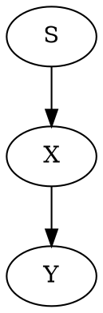

# 9. Using Vue in Markdown by Vicente <Badge text="default theme" vertical="top"/>

[toc]

## <Badge text="new!" type="error"/>9.1. Browser API Access Restrictions 

Because VuePress applications are server-rendered in Node.js when generAAating static builds, any Vue usage must conform to the [universal code requirements](https://ssr.vuejs.org/en/universal.html). In short, make sure to only access Browser / DOM APIs in `beforeMount` or `mounted` hooks.


Pasaremos los datos necesarios para construir un objeto ISBN al constructor de Libro (en nuestro caso una cadena con el isbn) y será este quien lo cree. En el fondo esto es lo que sucede con un tipo valor como DateTime por su 'naturaleza'.
De esta manera, además, el objeto Isbn13 que estoy creando desaparecerá junto con el libro.

If you are using or demoing components that are not SSR friendly (for example containing custom directives), you can wrap them inside the built-in `<ClientOnly>` component: ❤️

```php 
# Post Here Code Example
function base(a, b)
{
    print "hola";
    "123456789012345678901234 567890123456789 01234567890123456789012345 6789012345678 901234567890"
}
```

```java {no-line-numbers}
# Post Here Code Example
function base(a, b)
{
    print "hola";
    int i;
    i=a;
    b=a*i;

    return i;
}
```

<<< @/src/index.md{2,6}

<!-- pagebreak -->



 

|  |
| :-----------------------------------: |
|           *Cross-Relation*            |


<figure>
    
    <figcaption>Cross-Relation</figcaption>
</figure>

## 9.2. Browser API Access Restrictions

Because VuePress applications are server rendered in Node.js when generating static builds, any Vue usage must conform to the [universal code requirements](https://ssr.vuejs.org/en/universal.html). In short, make sure to only access Browser / DOM APIs in `beforeMount` or `mounted` hooks.

### 9.2.1 Third level heading 

If you are using or demoing components that are not SSR friendly (for example containing custom directives), you can wrap them inside the built-in `<ClientOnly>` component:

::: tip PRUEBA
This is a tip
:::

## 9.3. Browser API Access Restrictions

Because VuePress applications are server-rendered in Node.js when generating static builds, any Vue usage must conform to the [universal code requirements](https://ssr.vuejs.org/en/universal.html). In short, make sure to only access Browser / DOM APIs in `beforeMount` or `mounted` hooks.

If you are using or demoing components that are not SSR friendly (for example containing custom directives), you can wrap them inside the built-in `<ClientOnly>` component:

## 9.4. Browser API Access Restrictions

Because VuePress applications are server-rendered in Node.js when generating static builds, any Vue usage must conform to the [universal code requirements](https://ssr.vuejs.org/en/universal.html). In short, make sure to only access Browser / DOM APIs in `beforeMount` or `mounted` hooks.

If you are using or demoing components that are not SSR- friendly (for example containing custom directives), you can wrap them inside the built-in `<ClientOnly>` component:

## 9.5. Browser API Access Restrictions

Because VuePress applications are server-rendered in Node.js when generating static builds, any Vue usage must conform to the [universal code requirements](https://ssr.vuejs.org/en/universal.html). In short, make sure to only access Browser / DOM APIs in `beforeMount` or `mounted` hooks.

If you are using or demoing components that are not SSR friendly (for example containing custom directives), you can wrap them inside the built-in `<ClientOnly>` component:

## 9.6. Browser API Access Restrictions

Because VuePress applications are server-rendered in Node.js when generating static builds, any Vue usage must conform to the [universal code requirements](https://ssr.vuejs.org/en/universal.html). In short, make sure to only access Browser / DOM APIs in `beforeMount` or `mounted` hooks.

If you are using or demoing components that are not SSR friendly (for example containing custom directives), you can wrap them inside the built-in `<ClientOnly>` component:

## 9.7. Browser API Access Restrictions

Because VuePress applications are server-rendered in Node.js when generating static builds, any Vue usage must conform to the [universal code requirements](https://ssr.vuejs.org/en/universal.html). In short, make sure to only access Browser / DOM APIs in `beforeMount` or `mounted` hooks

If you are using or demoing components that are not SSR friendly (for example containing custom directives), you can wrap them inside the built-in `<ClientOnly>` component:
