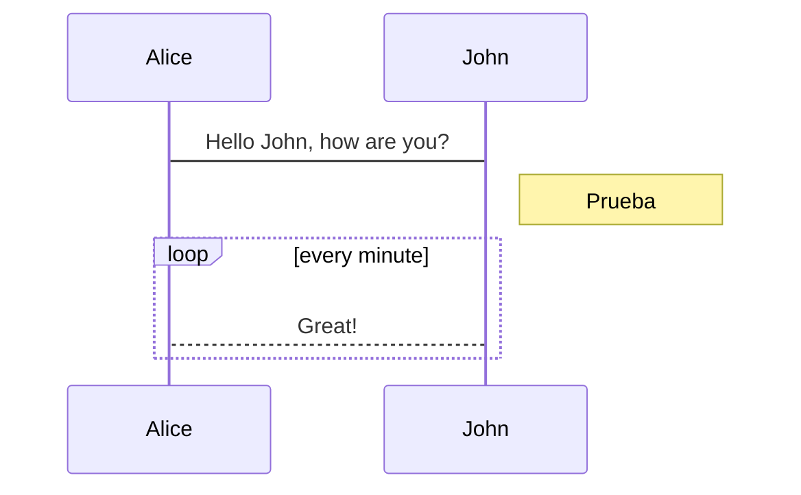
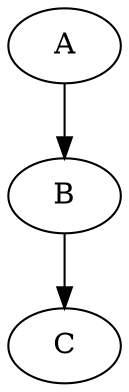

home: true
heroImage: /Logo_PSP.png
tagline: VuePress & Markdown
actionText: Access course →
actionLink: /unit1/
features:
- title: Feature 1 Título
  details: Feature 1 Description
- title: Feature 2 Title
  details: Feature 2 Description
- title: Feature 3 Title
  details: Feature 3 Description
footer: Made by Vicente Martínez with ❤️
---
```  

<div class="pagebreak"> </div>




  

  
<center>
  
| Hola |
| ---|
| *Cross-Relation* |
  
</center>
  
<div class="pagebreak"> </div>

## 9.2. Browser API Access Restrictions
  
Because VuePress applications are server rendered in Node.js when generating static builds, any Vue usage must conform to the [universal code requirements](https://ssr.vuejs.org/en/universal.html ). In short, make sure to only access Browser / DOM APIs in `beforeMount` or `mounted` hooks.
  
### 9.2.1 Third level heading 
  
If you are using or demoing components that are not SSR friendly (for example containing custom directives), you can wrap them inside the built-in `<ClientOnly>` component:
  
::: tip PRUEBA
This is a tip
:::
  
## 9.3. Browser API Access Restrictions
  
Because VuePress applications are server-rendered in Node.js when generating static builds, any Vue usage must conform to the [universal code requirements](https://ssr.vuejs.org/en/universal.html ). In short, make sure to only access Browser / DOM APIs in `beforeMount` or `mounted` hooks.
  
If you are using or demoing components that are not SSR friendly (for example containing custom directives), you can wrap them inside the built-in `<ClientOnly>` component:
  
## 9.4. Browser API Access Restrictions
  
Because VuePress applications are server-rendered in Node.js when generating static builds, any Vue usage must conform to the [universal code requirements](https://ssr.vuejs.org/en/universal.html ). In short, make sure to only access Browser / DOM APIs in `beforeMount` or `mounted` hooks.
  
If you are using or demoing components that are not SSR- friendly (for example containing custom directives), you can wrap them inside the built-in `<ClientOnly>` component:
  
## 9.5. Browser API Access Restrictions
  
Because VuePress applications are server-rendered in Node.js when generating static builds, any Vue usage must conform to the [universal code requirements](https://ssr.vuejs.org/en/universal.html ). In short, make sure to only access Browser / DOM APIs in `beforeMount` or `mounted` hooks.
  
If you are using or demoing components that are not SSR friendly (for example containing custom directives), you can wrap them inside the built-in `<ClientOnly>` component:

<code-group>
<code-block title="PHP Example">
```php
# Post Here Code Example
```
</code-block>

<code-block title="Java Title">
```java
// Post Here Code Example
```
</code-block>
</code-group>
  
## 9.6. Browser API Access Restrictions
  
Because VuePress applications are server-rendered in Node.js when generating static builds, any Vue usage must conform to the [universal code requirements](https://ssr.vuejs.org/en/universal.html ). In short, make sure to only access Browser / DOM APIs in `beforeMount` or `mounted` hooks.
  
If you are using or demoing components that are not SSR friendly (for example containing custom directives), you can wrap them inside the built-in `<ClientOnly>` component:
  
## 9.7. Browser API Access Restrictions
  
Because VuePress applications are server-rendered in Node.js when generating static builds, any Vue usage must conform to the [universal code requirements](https://ssr.vuejs.org/en/universal.html ). In short, make sure to only access Browser / DOM APIs in `beforeMount` or `mounted` hooks
  
If you are using or demoing components that are not SSR friendly (for example containing custom directives), you can wrap them inside the built-in `<ClientOnly>` component:

<OtherComponent/>

<<< @/src/index.md

::: tip Licencia
  <CCLicense-component />
:::

::: warning Licencia
  <CCLicense-component />
:::

::: danger Licencia
  <CCLicense-component />
:::

::: details Licencia
  <CCLicense-component />
:::

> <CCLicense-component />


